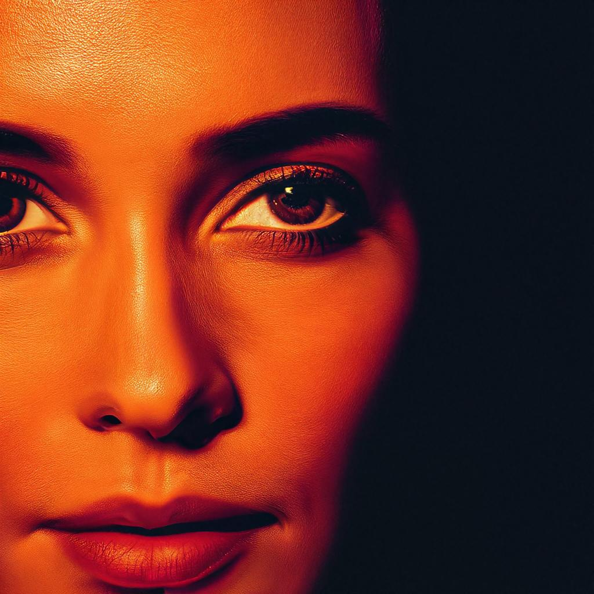

<div align="center">
    <h1 align="center"> Deep Floyd IF with Multiple GPU</h1>
    <p>Serve state-of-the-art stable diffusion model with multiple GPU with ease.
        </br>
        <i>Powered by BentoML 🍱 + <a href="https://stability.ai/">StabilityAI</a> 🎨 + HuggingFace 🤗</i>
    </p>
</div>

## 📖 Introduction 📖
- 🧪 **Stable Diffusion**: Stable Diffusion is a deep learning, text-to-image model primarily used to generate detailed images conditioned on text descriptions.

- 🔮 **[IF by DeepFloyd Lab](https://github.com/deep-floyd/IF)**: IF is a novel state-of-the-art open-source text-to-image model with a high degree of photorealism and language understanding.

- 🚀 **BentoML with IF and GPUs**: In this project, BentoML demonstrate how to serve IF models easily across multiple GPU

- 🎛️ **Interactive Experience with Gradio UI**: You can play with the hosted IF model with an interactive Gradio UI.

## 🏃‍♂️ Running the Service 🏃‍♂️
### Prerequisite
To be able to run this project locally, you will need to have the following:
- Python 3.8+
- `pip` installed
- At least 2x16GB VRAM GPU or 1x40 VRAM GPU

### Installing Dependencies
It is recommended to use a Virtual Environment in your python projects for dependencies isolation. Run the following to install dependencies:
```bash
pip install -r requirements.txt
```

### Import the IF Models
To download the IF Models to your local Bento Store: 
```bash
python import_models.py
```

### Run the Web Server with Gradio
Run the server with web UI powered by gradio:

```bash
# For a GPU with more than 40GB VRAM, run all models on the same GPU
python start-server.py

# For two Tesla T4 with 15GB VRAM each, 
# assign stage1 model to the first GPU, 
# and stage2 and stage3 models to the second GPU
python start-server.py --stage1-gpu=0 --stage2-gpu=1 --stage3-gpu=1

# For one Tesla T4 with 15GB VRAM and two additional GPUs with smaller VRAM size, 
# assign stage1 model to T4, 
# and stage2 and stage3 models to the second and third GPUs respectively
python start-server.py --stage1-gpu=0 --stage2-gpu=1 --stage3-gpu=2
```

Then you can visit the web UI at <http://localhost:7860>. BentoML's api endpoint is also accessible at <http://localhost:3000>. To show all options that you can change (like server's port), just run `python start-server --help`

### Example Prompt
**Prompt**
```
orange and black, head shot of a woman standing under street lights, dark theme, 
Frank Miller, cinema, ultra realistic, ambiance, insanely detailed and intricate, 
hyper realistic, 8k resolution, photorealistic, highly textured, intricate details
```
**Negative Prompt**
```
 tiling, poorly drawn hands, poorly drawn feet, poorly drawn face, out of frame, 
 mutation, mutated, extra limbs, extra legs, extra arms, disfigured, deformed, 
 cross-eye, body out of frame, blurry, bad art, bad anatomy, blurred, text, 
 watermark, grainy
```
**Results**


## 🚀 Bringing it to Production 🚀
For this project, as it requires huge GPU devices which we typically do not have locally, it is particularly beneficial to deploy via [☁️ BentoCloud](https://www.bentoml.com/bento-cloud/) -- A managed distributed compute platform for Machine Learning Serving.

Otherwise, BentoML offers a number of options for deploying and hosting online ML services into production, learn more at [Deploying Bento](https://docs.bentoml.org/en/latest/concepts/deploy.html).


## 👥 Community 👥
BentoML has a thriving open source community where thousands of ML/AI practitioners are 
contributing to the project, helping other users and discussing the future of AI. 👉 [Pop into our Slack community!](https://l.bentoml.com/join-slack)
